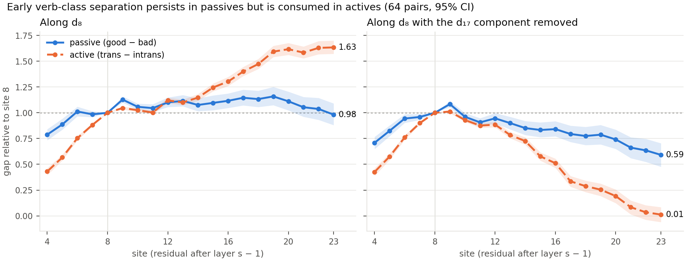

# Round 3: results

Plan, predictions and decision rules: `round3_plan.md`, each part committed
before its runs (Part A: `a163716`). Generated reports:
- A1: `round3_reliability.md`;
- A2: `round3_late_projection.md`;
- A3: `round3_dose_decomp.md`;
- A4: `round3_token_rank.md`.

TSUBAME jobs (commit `a163716`): 8938121 (A2), 8938122 (A3), 8938123–8938124
(A4 ranks). A1 and the A4 token split ran locally on committed outputs.

# Part A: cheap checks

## Summary

- **A1.** Every per-pair measure is stable across contexts (R ≥ 0.985), so
  the frequency-vs-behaviour null is **not a measurement failure**. It is
  "no moderate link" for 7 of 24 tests and "no detectable link, moderate
  not excluded" for 16; site 4 vs the LP margin is significant (+0.22).
- **A2.** Along d_8, the transitive/intransitive separation is **present at
  every site through 23 in both voices**. Removing the d_17 component shows
  the voices diverge: the passive separation largely stays (0.79× at site
  17), the active one **declines** (0.34× at 17, ≈ 0 by 22). The declared
  rule reads "unresolved" at 14–17, because the ratio rises instead of
  staying flat.
- **A3.** The object acceleration above the passive range is real in the
  logits, but its net source is mostly the **final-LN scale term**. The late
  MLPs (15, 18, 21, 22) do write more objects there, but MLPs 11 and 13
  write fewer by about as much: a **handover**, not a net gain. " by"
  flattens because MLPs 8–17 stop raising it.
- **A4.** Higher rank gives **limited improvement** at this training budget
  (rank 4: +0.07 IIA at site 4, +0.04 at site 6; the rule keeps rank 1).
  **No token-count deficit is detected** within expansion pairs, but the CIs
  still allow deficits of ≥ 0.1. Why early IIA is low remains open.

## Summary of Parts B and C

- **B5, reverse DAS.** The passive-trained direction is aligned with the
  active one early (|cos| 0.57 at site 4) and transfers to actives, raising
  objects (sites 4–6). It rotates away with depth (0.22 at 17) and becomes
  passive-specific (16–17: no object rise, even with active donors). At
  every site it also raises " by" in actives.
- **B6, get-passives.** The site-8 switch generalizes from "was" to "got"
  (D(O) got − was +0.15, inside ±δ; " by" transfer preserved). The natural
  *by* gap is larger after "got" (0.93 vs 0.71).
- **B7, path patching.** The was/has frame switch reaches the " by" MLPs
  11–17 mainly through attention heads (joint heads 67–115% of the switch),
  and the object MLPs 15–22 mainly through earlier MLPs. The aux-value test
  favours heads reading the auxiliary, but H2 (five heads suffice) and H3
  (declared attention bar) fail.
- **C8, nonce verbs.** A nonce verb used transitively in context lands
  further toward the transitive side of d in a later passive (+0.13 to
  +0.15 z at sites 6–8). It also raises " by" more than other prepositions.
  Both effects are verb-specific in the balanced design.
- **C9, gap constructions.** Both natural gates pass. Declared readings are
  mostly "mixed", because objects rise too. Post hoc: at site 8 the
  transitive value reproduces each construction's own natural
  transitive-vs-intransitive profile; at site 17 it gives "object next"
  everywhere.

## A1. Split-half reliability

| Measure | Units per pair | R (Pearson, median over 1,000 splits) |
|---|---:|---|
| passive gap, sites 4–17 | 125 | 0.997–1.000 |
| passive gap, Zipf/band-residualized | 125 | 0.997–1.000 |
| active gap, sites 4–17 | 7 subjects | 0.985–0.996 |
| single-prompt " by" preference | 125 | 0.997 |
| released *by* margin | 300 | 0.999 |
| curated LP margin | 125 | 0.989 |

- The per-pair passive gap is also consistent across the three basis
  splits (mean r 0.98–0.99).
- So the disattenuated correlations equal the observed ones to two
  decimals.

| Behaviour | Sites 4–17, r observed | Verdicts |
|---|---|---|
| curated LP margin | −0.06 to +0.22 | no moderate link at 8–17 (6 sites); not excluded at 6; **significant at 4** (+0.22 [+0.00, +0.43]) |
| released *by* margin | +0.01 to +0.17 | no moderate link at 6 (upper bound 0.28); not excluded elsewhere (upper bounds 0.30–0.40) |
| single-prompt " by" preference | +0.06 to +0.20 | not excluded at every site (upper bounds 0.30–0.42) |

**Against the predictions.**
- Reliability ≥ 0.9 for context-averaged measures, ≥ 0.7 for the active gap,
  ≥ 0.8 after residualizing, ≥ 0.9 across bases: **held** (all ≥ 0.98).
- Most tests land in "no detectable link": **held** (16 of 24). Site 4
  significant: **held** (LP margin only).

**Reading.** Moderate links to the LP margin are excluded at sites 8–17;
site 4 is significantly positive and site 6 is inconclusive. Most *by*
tests do not exclude a moderate link (upper bounds 0.30–0.42). In no case is
the null a "couldn't measure" result. Two limits remain: context-split
reliability shows stability, not validity; and the single-prompt " by"
preference shares contexts with the gap, so their errors may correlate.

## A2. Is the site-8 separation still present late?

Raw projection units, 64 primary pairs (full tables:
`round3_late_projection.md`).

Figure: `scripts/plot_late_projection.py`; each voice's gap is indexed to its own site-8 value.

| Site | d_8: passive gap | d_8: active gap | d_8 ratio | d_8⊥17: passive gap | d_8⊥17: active gap | d_8⊥17 ratio | own-site ratio |
|---:|---:|---:|---:|---:|---:|---:|---:|
| 8 | 3.67 | 8.76 | 0.42 | 3.31 | 6.85 | 0.48 | 0.42 |
| 12 | 4.03 | 9.81 | 0.41 | 3.13 | 6.06 | 0.52 | 0.38 |
| 14 | 3.94 | 10.05 | 0.39 | 2.82 | 4.97 | 0.57 | 0.32 |
| 16 | 4.09 | 11.42 | 0.36 | 2.79 | 3.50 | 0.80 | 0.25 |
| 17 | 4.20 | 12.26 | 0.34 | 2.63 | 2.30 | 1.15 | 0.20 |
| 20 | 4.07 | 14.16 | 0.29 | 2.45 | 1.32 | 1.87 | — |
| 23 | 3.60 | 14.31 | 0.25 | 1.96 | 0.09 | — | — |

- **d_8.** The passive gap is flat from site 8 to 23 (retention 0.98–1.16);
  the active gap grows to 1.6×. Passive AUC over verb means stays ≥ 0.96.
- **d_8⊥17.** Passives keep 0.79× of the site-8 gap at 17 (AUC 0.96) and
  0.59× at 23 (AUC 0.85). Actives fall to 0.34× at 17 and to ≈ 0 at 22–23
  (AUC 0.51): the early-only component is gone in actives.
- **Declared rule** (ratio within ±0.1 of site 8 while own-site falls):
  "retained alongside the conversion" at 12; **unresolved** at 14, 16 and
  17. There the d_8⊥17 ratio *rises* (+0.08, +0.31, +0.66), because the
  active gap vanishes. The rule did not anticipate this.

**Against the predictions.**
- Present in both voices through 17, and at 20 and 23: **held** on d_8. On
  d_8⊥17, actives fail at 20–23.
- Active d_8 gap retained or growing: **held** (1.40× at 17).
- The d_8 ratio declines but stays above the own-site ratio: **held**
  (0.34 vs 0.20 at 17).
- The d_8⊥17 ratio stays near its site-8 value: **held at 12, missed at
  14–17.**

**Reading.** Along d_8⊥17, the active separation declines between sites
12 and 22 while the passive separation largely persists. This is consistent
with the site-8 mechanism result (the early value feeds object writers in
actives, and much less in passives), but it does not establish rotation,
erasure, or persistence of the same functional variable: it is retained
*linear* separation along one fixed read-out, without patching.

## A3. Decomposing the gradual push

Bad passives, coordinate-setting patches at site 8, per z unit (full
tables: `round3_dose_decomp.md`). Both LN versions (per-interval and fixed
σ) give closely similar estimates (within 0.01) and identical decisions.

| Interval | Ō actual | carry | downstream net (P / N) | LN-scale term | Δ log P(O) | Δ log P(" by") |
|---|---:|---:|---|---:|---:|---:|
| R_p [0.10, 0.45] | +0.50 | +0.47 | +0.09 (+0.77 / −0.68) | −0.06 | +0.27 | +0.92 |
| [0.45, 0.90] | +0.61 | +0.47 | +0.08 (+0.57 / −0.48) | +0.06 | +0.46 | +0.56 |
| [0.90, 1.50] | +0.76 | +0.47 | +0.12 (+0.60 / −0.48) | +0.17 | +0.73 | +0.43 |

**Declared decisions.**
- **Acceleration in the logits: yes.** A = +0.26 [+0.21, +0.32] per z,
  ratio 1.52.
- **Creep = carry: no.** The carry is 94% [86%, 104%] of the net Ō change
  in R_p. But downstream components write in both directions, P 0.77 and N
  0.68 per z, each larger than the carry (0.47), and the rule requires
  smaller.
- **Late-MLP contribution: yes.** MLPs 15, 18, 21 and 22 raise their
  object rate by +0.24 [+0.22, +0.27], 0.93 of A.

**What the rule did not capture.** A splits into carry +0.01, downstream
net +0.03 [−0.03, +0.09] and **LN-scale term +0.23 [+0.19, +0.27]**.
- The late-MLP increase is offset by decreases in MLP11 (−0.14), MLP13
  (−0.09), MLP8 and MLP16. Downstream components hand the object push from
  mid to late MLPs as z rises; they add almost nothing net.
- The net acceleration of Ō is the final LayerNorm scale shrinking as z
  rises, which sharpens the whole output distribution (object tokens have
  high centered logits).
- In log P(O), the acceleration (0.27 → 0.73) is split between the object
  set (LSE_O: 0.18 → 0.39) and the partition function (LSE_all: −0.09 →
  −0.34).

**" by" flattening** (0.83 → 0.09 per z in Ō units; log P 0.92 → 0.43).
- Downstream net falls from +0.96 to −0.20, mainly because the MLPs that
  raise " by" in R_p (8, 9, 10, 12, 13, 14, 16, 17) lower their rates.
  Together, MLPs 11, 13, 14, 16 and 17 lose −0.73 per z.
- MLP23 still lowers " by" above the range, but by less than inside it
  (+0.22 rate change). It is not what flattens " by".

**Against the predictions.**
- Ō rate rises (ratio ≥ 1.25): **held.**
- Creep mostly carry (≥ 60%): **held on net share (94%)**, but the declared
  rule says no because of large two-way downstream writes.
- MLPs 15, 18, 21, 22 give ≥ 50% of A: **held by the rule**, but
  **misleading**. They are offset by MLPs 11 and 13, and the net
  acceleration is the LN term.
- " by" flattens because MLPs 11–17 stop growing (**held**) and MLP23 keeps
  lowering it (**held**: still −0.42 per z above the range). But MLP23's
  suppression weakens (−0.64 → −0.42), so its rate change opposes the
  flattening rather than causing it.

## A4. Robustness of low early IIA

**Rank** (paired by fold × split, 15 runs per site):

| Site | Rank 1 IIA | Rank 2 gain | Rank 4 gain | Rule |
|---:|---:|---|---|---|
| 4 | 0.45 | +0.02 [+0.01, +0.04] | +0.07 [+0.05, +0.09] | rank 1 (gap fraction +0.06 < 0.1) |
| 6 | 0.66 | +0.02 [+0.00, +0.03] | +0.04 [+0.02, +0.07] | rank 1 (+0.05) |

**Token count, expansion pairs only** (6 single vs 15 multi), held-out
cross-class IIA:

| Site | I←T: single / multi | T←I: single / multi |
|---:|---|---|
| 4 | 0.52 / 0.54 | 0.40 / 0.37 |
| 6 | 0.65 / 0.67 | 0.62 / 0.73 |
| 12 | 0.83 / 0.91 | 0.94 / 0.96 |

The multi − single differences are −0.03 to +0.10, with CIs spanning about
±0.3 at sites 4–6.

**Against the predictions.**
- The rank rule keeps rank 1: **held.**
- Rank-4 IIA gain < 0.05: **missed at site 4** (+0.07), held at 6.
- Multi-token IIA ≥ 0.1 below single-token at 4 and 6: **missed.** The
  difference has the opposite sign or is near zero.

**Reading.** Higher rank gives limited improvement at the tested training
budget (rank 4 recovers only a small part). No token-count deficit is
detected, but with 6 single-token expansion pairs the CIs remain compatible
with deficits of ≥ 0.1. These checks do not establish why early IIA is
low.

# Part B: generalization and mechanism

Plan: `round3_plan.md`, Part B (committed `8eb1a25`; code-review fixes
`96bf2b4`, before any affected output). Jobs: 8938508 (B6), 8938509 (B7),
8938510 (B5 sweep), 8938540–8938547 (B5 final). Reports:
`round3_get_passive.md`, `round3_path_patch.md`, `round3_reverse.md`.

## B7. What switches the flagged MLPs between frames?

"The N was V" vs "The N has V" under the same site-8 T-donor patch (11,657
patched rows, 64 pairs, fp32). Replacing every upstream component
reproduces the switch to ≤ 5e-6 (exactness check). Full tables:
`round3_path_patch.md`.

| MLP | readout | Δ was | Δ has | S = has − was | heads (joint) | earlier MLPs (joint) | carry |
|---:|---|---:|---:|---:|---:|---:|---:|
| 11 | " by" | +0.18 | −0.24 | −0.41 | −0.37 | +0.09 | +0.03 |
| 13 | " by" | +0.16 | −0.11 | −0.27 | −0.31 | +0.10 | +0.02 |
| 14 | " by" | +0.30 | −0.31 | −0.62 | −0.45 | +0.03 | +0.02 |
| 16 | " by" | +0.15 | −0.32 | −0.47 | −0.32 | +0.01 | −0.00 |
| 17 | " by" | +0.15 | −0.29 | −0.44 | −0.32 | +0.01 | −0.00 |
| 15 | Ō | −0.02 | +0.24 | +0.26 | −0.02 | +0.33 | +0.01 |
| 18 | Ō | +0.06 | +0.34 | +0.28 | +0.01 | +0.24 | +0.01 |
| 21 | Ō | −0.03 | +0.16 | +0.19 | −0.01 | +0.24 | +0.00 |
| 22 | Ō | −0.02 | +0.14 | +0.16 | −0.04 | +0.23 | +0.00 |

**Declared decisions.**
- **Gate: passes.** In the has frame all 9 MLPs take the sign of the step-1
  active profile, so the was/has contrast captures the switch. The
  tense-matched "had" frame gives the same switch (Δ had ≈ Δ has).
- **H1, heads carry the switch: holds** (5 of 9, exactly the five " by"
  MLPs; joint head replacement gives 67–115% of S).
- **Alternative, earlier MLPs: fails overall** (4 of 9), but it holds for
  all four object MLPs, where heads contribute ≈ 0.
- **H2, few heads: fails.** The top 5 heads chosen on half A (L9H7, L10H2,
  L3H3, L1H6, L8H4) give 34–43% of the head effect on half B (78% for
  MLP11). The head signal is spread over more heads.
- **H3, they read the auxiliary: fails by the declared rule.** L10H2's
  attention to "was" is 0.29, under the 0.3 bar; the other four are
  0.35–0.75. Replacing only the auxiliary's value vector reproduces 71–132%
  of the top-5 effect for all five " by" MLPs; pattern-only replacement
  gives 38–68%.

**Against the predictions.** Gate passes: **held.** H1 holds for the " by"
MLPs and fails for the late object MLPs, which are switched through earlier
MLPs: **held exactly.** H2: **missed.** H3: **missed narrowly** (one head
at 0.29), with the value test strongly in its favour.

**Reading.** Joint head replacement reproduces most of the switch in the
five " by" MLPs (11–17), and joint earlier-MLP replacement reproduces most
of it in the four object MLPs (15, 18, 21, 22), where heads contribute
≈ 0. This supports a possible two-stage account: heads at the participle
reading the auxiliary's value (L9H7 is the largest single path everywhere,
then L10H2, L3H3, L8H4, L1H6, L3H2, L15H5) switch the mid-layer MLPs, and
the late object MLPs depend on mid-layer MLPs (12, 16, 13, 17, 11, 14).
These are local path effects into each target MLP, with sizeable group
interactions; they do not establish the full serial pathway.

Caveat: was → has also changes tense/aspect and the subject's role, so
this is an auxiliary/frame switch, not an isolated voice manipulation.

## B5. Reverse DAS: trained on passives, tested on actives

Rank-1 directions d_p trained on passives (29 strict pairs, 26 kept by the
behaviour filter; same fold ids as the active run; read-out *by* log-odds;
epoch 1 at every site by the frozen rule), then patched into actives. Full
tables: `round3_reverse.md`. Order as declared: frozen configs committed
(`c84d287`), passive-side results committed (`7d59792`), then the active
test (job 8938751).

**Passive side.** The robustness gate passes at every site (15 of 15 runs
beat the norm-matched random null). Held-out Δ M_p for bad ← good is +1.5
(site 4) to +3.0 (site 17) against a random 95th percentile of ≈ 0.1. That
is 0.83× to 1.69× the base pair's natural gap, so the class-forcing
objective pushes past the natural difference at mid and late sites.
Shuffled-label DAS again finds a weaker copy (+0.5 to +1.0).

**Active test** (bad active bases "She has emerged", 64 primary pairs):

| Site | \|cos(d_p, d_a)\| | Arm 1: d_p + passive donors, O / by | Arm 2: d_a + same donors, O / by | Arm 3: d_p + active donors, O / by | Active AUC along d_p | Reading |
|---:|---:|---|---|---|---:|---|
| 4 | 0.57 | **+0.80 RISE** / +0.82 | +1.39 / −0.06 | +0.68 RISE / +0.59 | 0.96 | **aligned, with cross-frame causal transfer** |
| 6 | 0.51 | **+0.75 RISE** / +1.28 | +1.25 / −0.06 | +0.62 RISE / +0.94 | 0.96 | **aligned, with cross-frame causal transfer** |
| 8 | 0.46 | +0.77 RISE / +1.73 | +1.14 / −0.06 | +0.51 RISE / +1.00 | 0.95 | mixed (cos below 0.5) |
| 10 | 0.41 | +0.48 unresolved / +2.31 | +1.10 / −0.08 | +0.31 NO RISE / +1.26 | 0.96 | mixed |
| 12 | 0.39 | +0.37 NO RISE / +2.87 | +1.16 / −0.23 | +0.30 NO RISE / +1.76 | 0.97 | mixed |
| 14 | 0.33 | +0.02 NO RISE / +3.11 | +1.12 / −0.21 | +0.10 NO RISE / +1.91 | 0.97 | mixed (cos above 0.3) |
| 16 | 0.26 | −0.25 NO RISE / +3.25 | +0.92 / −0.14 | −0.02 NO RISE / +2.13 | 0.96 | **passive-specific** |
| 17 | 0.22 | −0.33 NO RISE / +3.34 | +0.76 / −0.11 | −0.04 NO RISE / +2.28 | 0.96 | **passive-specific** |

Every RISE lies far beyond the random null (95th percentile of D(O) ≈
0.03–0.05). Within-run stability of d_p is 0.93–0.95 at every site.

**Against the predictions.**
- Aligned with transfer at 4–10: **held at 4–6**, missed at 8 (cos 0.46,
  just under the 0.5 bar, although O rises) and 10.
- Passive-specific at 14–17: **held at 16–17**; 14 is mixed (cos 0.33).
- 12 in between: **held.**
- Arm 1 smaller than arm 2 early: **held** (0.80 vs 1.39 at site 4).
- D(" by") on actives ≤ 0 at 4–8: **missed.** d_p raises " by" in actives
  at every site (+0.8 at site 4, +1.7 at site 8, +3.3 at site 17). Positive
  at 14–17: held.
- Passive training weaker than active training: **missed.** Held-out IIA is
  comparable to the active run at every site and higher at sites 4–8 (0.62 /
  0.73 / 0.80 vs 0.45 / 0.66 / 0.78), against a natural threshold accuracy
  of 0.81.

**Reading.** A direction learned from the passive *by* preference always
carries a "*by* next" component: patched into actives, it raises " by" at
every site. Early on (4–6) it also shares about half its direction with
the active verb-class direction (cos 0.51–0.57) and raises objects in
actives. With depth it rotates away (cos 0.22 at 17); its object effect
first vanishes and then turns slightly negative, while its " by" effect
triples. The dose control rules out a weak-donor explanation: active donors
along d_p do not raise objects from site 10 on either. Meanwhile the
active-trained direction, fed the same passive donors, raises objects at
every site, and d_p separates transitive from intransitive actives at
every site (AUC ≈ 0.96). So the verb-class contrast is present along both
directions, but only d_a turns it into objects. This mirrors the original
passive test from the other side: early, the two voices share a verb-class
variable; late, each voice has its own "next" variable. As declared, cos ≥
0.5 means only ≥ 25% shared variance; this does not show the two
directions carry the same variable.

## B6. Get-passive transfer

The passive test rerun with "got" for "was" on identical plan rows (all
eight sites); full tables: `round3_get_passive.md`.

| Site | D(O): was / got | D(" by"): was / got | got − was: O [90% CI] | got − was: by | Outcome was / got |
|---:|---|---|---|---|---|
| 4 | +0.10 / +0.17 | +0.58 / +0.71 | +0.06 [+0.03, +0.09] | +0.13 | abstract / abstract |
| 6 | +0.23 / +0.33 | +0.69 / +0.79 | +0.10 [+0.07, +0.14] | +0.10 | abstract / abstract |
| 8 | +0.36 / +0.51 | +0.72 / +0.83 | +0.15 [+0.10, +0.19] | +0.11 | abstract / mixed |
| 10 | +0.69 / +0.94 | +0.77 / +0.87 | +0.25 [+0.19, +0.30] | +0.11 | mixed / mixed |
| 12 | +1.17 / +1.29 | +0.81 / +0.79 | +0.12 [+0.05, +0.19] | −0.01 | mixed / mixed |
| 14 | +2.40 / +2.14 | +0.46 / +0.30 | −0.26 [−0.34, −0.18] | −0.16 | surface / surface |
| 17 | +3.58 / +2.97 | −0.93 / −0.99 | −0.61 [−0.68, −0.54] | −0.06 | surface / surface |

- Natural good − bad *by* gap: 0.93 [0.66, 1.18] after "got", 0.71 after
  "was".
- Natural projection along d (no patching): the got and was good − bad gaps
  are nearly identical at every site (site 8: 0.35 vs 0.36; ratio to the
  active gap 0.40 vs 0.42).

**Declared decision (site 8): generalizes to got.** D(O) got − was is
+0.15, 90% CI [+0.10, +0.19], inside ±δ_8 = 0.49. " by" transfer is
preserved (+0.83 vs +0.72). The 48-pair eventive subset gives the same.

**Against the predictions.** Smaller natural *by* gap after "got":
**missed** (larger, 0.93). Site 8 generalizes: **held.** Same depth
pattern: **held up to one step.** got-passives read "mixed" at site 8,
because D(O) = 0.51 crosses δ = 0.49 by 0.02; the paired rule was added for
exactly this case.

**Reading.** Transfer generalizes to "got": the early value raises " by"
after "got" as after "was", so the literal token "was" is not required.
What feature the switch reads remains unidentified. Object leakage at 8–10
is slightly larger with "got" (+0.15 to +0.25), consistent with "got" also
allowing other parses.

# Part C: extensions

Plan: `round3_plan.md`, Part C (committed `1a8cefb`; the declared
PREP-without-by readout added to the runner in `6dae83e` before any
output). Jobs: 8938558 (C8), 8938556 (C9). Reports: `round3_nonce.md`,
`round3_constructions.md`.

## C8. Nonce verbs

80 nonce lemmas × 4 slots; per-lemma means; lemma bootstrap. Passive
probe "The house was dakked", z on each site's d (fixed ruler). The probe
was a token suffix of every prompt (checked).

| Site | matched T − I | balanced AB − BA | mismatched (1 / 2) | real good − bad, same long context | active probe: matched |
|---:|---|---|---|---|---|
| 6 | +0.13 [+0.12, +0.13] | +0.12 [+0.12, +0.13] | +0.03 / +0.03 | +0.48 | +0.18 |
| 8 | +0.15 [+0.14, +0.16] | +0.11 [+0.10, +0.11] | +0.05 / +0.05 | +0.37 | +0.24 |
| 12 | +0.27 | +0.21 | +0.10 / +0.10 | +0.36 | +0.49 |
| 17 | +0.24 | +0.18 | +0.08 / +0.08 | +0.18 | +0.60 |

Log-probabilities at the passive probe (balanced AB − BA): " by" +0.56
[+0.49, +0.62]; other prepositions +0.18; O +1.34; "." −0.71. Matched T − I:
" by" +1.44, other prepositions +0.88, O +2.14.

**Declared decisions (sites 6 and 8).** Context-sensitive separation along
d: **yes** at both. Verb-specific (balanced): **yes** at both. Raises
" by" verb-specifically, more than other prepositions: **yes**.

**Causal check.** Moving the T-context probe's coordinate along d_s into
the I-context probe raises " by" by only +0.03 (site 6) and +0.05 (site 8)
nats. The coordinate difference is small (≈ 0.13–0.15 z), so d carries
only a small part of the context's effect on " by".

**Against the predictions.** Δ_matched ≈ 0.1–0.2 z: **held** (0.13,
0.15). Verb-specific and smaller than matched: **held.** " by" raised more
than other prepositions: **held.** Active-probe Δ ≥ 2× passive: **missed**
(1.4–1.6×).

**Reading.** When a novel verb has been used transitively a few sentences
earlier, its passive participle sits further toward the transitive side
of d at sites 6–8 (27%–41% of the real-verb passive gap),
and the model expects " by" more. Both effects are tied to the verb, not to
the objects in the context. Two caveats. The large rise in object starts
after the passive probe is most likely in-context copying ("dakked the" in
the context). And moving the d coordinate alone raises " by" only
slightly (+0.03 to +0.05), while the reverse transfer does not reliably
lower it; these interventions do not quantify how much of the context
effect is mediated by d.

## C9. Object relatives and tough constructions

64 primary pairs × 24 contexts per construction; full tables and the
tokens driving each effect: `round3_constructions.md`.

**Gates.** Both natural gates pass: good − bad L_OR = +2.26 [+1.95,
+2.58], L_TC = +1.48 [+1.18, +1.78]. The TC base-form gate passes at every
site (AUC 0.99–1.00). Pythia itself expects objects more after a
transitive verb in both constructions (natural O gap +1.49 in OR, +0.56 in
TC), unlike in passives (−0.22).

**Declared readings** (D on the bad item, T − I donors):

| Site | OR: D(O) | OR: D(L) | OR reading | TC: D(O) | TC: D(L) | TC reading |
|---:|---:|---:|---|---:|---:|---|
| 4 | +1.05 | +1.91 | mixed | +0.30 | +1.41 | **consistent with direct-gap licensing** |
| 6 | +1.16 | +2.13 | mixed | +0.37 | +1.58 | unresolved |
| 8 | +1.41 | +2.10 | mixed | +0.92 | +1.54 | mixed |
| 12 | +2.66 | +1.17 | mixed | +2.05 | +0.99 | mixed |
| 17 | +3.59 | +1.28 | mixed | +4.06 | +0.40 | mixed |

From site 14 on, L rises only because PREP falls; the numerator (MAIN or
END) falls. By the declared table that is "mixed", but in substance it is
"object next" displacing every other continuation.

**Within-construction swap** (good item's verb state into the bad item):
L rises by +1.6 to +1.9 (OR) and +0.9 to +1.2 (TC) at sites 4–10, and
decays with depth (+0.35 and +0.04 at 17).

**Against the predictions.** Both gates pass: **held.** OR licensing at
4–8: **missed** (mixed: objects rise too). TC licensing at 4–8: held at 4
only. Surface at 14–17: **missed by the declared table** (mixed, because
PREP falls), though substantively object-next. The swap raises L at 4–12:
**held.**

**Post hoc: the early value reproduces each construction's own transitive
profile.** Comparing D (T − I donors) with the natural good − bad gap of
the same construction, readout by readout:

| | site 8: D / natural gap | site 17: D / natural gap |
|---|---|---|
| passive | by +0.72 / +0.71; "." −0.01 / −0.02; O +0.36 / −0.22 | by −0.93; "." −1.99; O +3.58 |
| OR | MAIN +1.47 / +1.46; PREP −0.63 / −0.80; O +1.41 / +1.49 | MAIN −1.13; PREP −2.41; O +3.59 |
| TC | END +0.75 / +0.57; PREP −0.80 / −0.91; O +0.92 / +0.56 | END −1.33; PREP −1.73; O +4.06 |

At site 8, patching a transitive value into an intransitive verb produces
roughly what swapping in a transitive verb would produce *in that
construction*: more " by" in passives, more main-clause and closure tokens
(and fewer prepositions) in the two gap constructions, plus some excess
object mass (+0.4–0.6 nats) in passives and
tough constructions. At site 17 the same patch produces "object next"
whatever the construction. This was not a declared analysis. It suggests
that the passive "abstract" result is one case of a construction-general
early verb-class value; the object relative only looks "mixed" because
Pythia's own object-relative behaviour includes object expectation.
